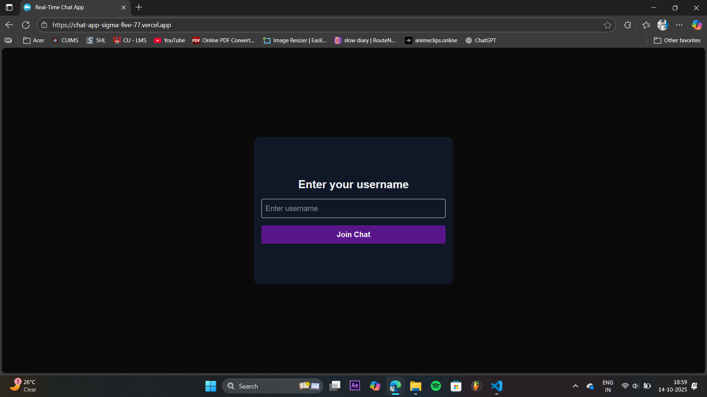
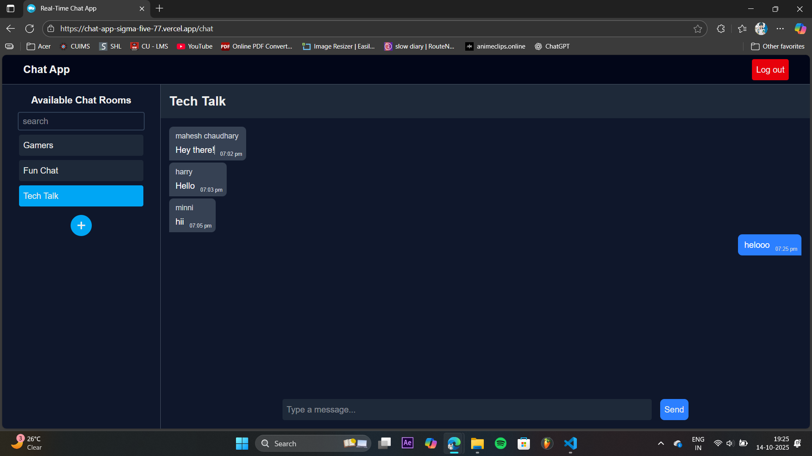

# 💬 Real-Time Chat Application

A **real-time chat application** built with **Next.js**, **Firebase Authentication**, and **Cloud Firestore**.  
This project was developed as part of my internship to showcase practical skills in building interactive, real-time web applications with secure backend integration.

👉 **[Live Demo](https://chat-app-sigma-five-77.vercel.app/)**

---

## 🚀 Features

- 🧑‍💻 **Anonymous Authentication** — users can join the chat using a unique username without sign-up.  
- 💬 **Real-Time Messaging** — powered by Firebase Firestore's `onSnapshot` for instant message updates.  
- 🏠 **Multiple Chat Rooms** — users can create or join rooms dynamically.  
- 🔍 **Search Rooms** — quickly find rooms by name.  
- 📌 **Persistent Room Selection** — active chat room stays selected even after refreshing.  
- 🌙 **Dark Themed UI** — clean, modern, and responsive interface.  
- 📱 **Responsive Sidebar** — optimized for mobile and desktop view.  
- 🧹 **Auto Scroll** — chat view stays at the latest message.

---

## 🛠️ Tech Stack

- [Next.js 14 (App Router)](https://nextjs.org/)
- [React](https://react.dev/)
- [Firebase Authentication](https://firebase.google.com/docs/auth)
- [Firebase Firestore](https://firebase.google.com/docs/firestore)
- [Tailwind CSS](https://tailwindcss.com/)
- [Vercel](https://vercel.com/) — for deployment

---

## 🧰 Environment Variables

Create a `.env.local` file in the project root and add your Firebase config:

```env
NEXT_PUBLIC_API_KEY=YOUR_API_KEY
NEXT_PUBLIC_AUTH_DOMAIN=YOUR_AUTH_DOMAIN
NEXT_PUBLIC_PROJECT_ID=YOUR_PROJECT_ID
NEXT_PUBLIC_STORAGE_BUCKET=YOUR_STORAGE_BUCKET
NEXT_PUBLIC_MESSAGING_SENDER_ID=YOUR_MESSAGING_SENDER_ID
NEXT_PUBLIC_APP_ID=YOUR_APP_ID
NEXT_PUBLIC_MEASUREMENT_ID=YOUR_MEASUREMENT_ID
```

> ⚠️ These must also be set in your **Vercel Project Settings → Environment Variables** for the deployed version to work.

---

## 🧭 Getting Started (Local Development)

1. Clone the repository  
2. Install dependencies using `npm install`  
3. Set up your Firebase project:
   - Create a Firebase project at Firebase Console  
   - Enable **Anonymous Authentication**  
   - Create a **Cloud Firestore** database  
   - Add your **Authorized Domain** for Vercel in Authentication settings  
   - Update Firestore security rules appropriately  
4. Run the development server with `npm run dev`  
5. Open http://localhost:3000 in your browser

---

## 🌐 Deployment

This project is deployed on **Vercel**.  
To deploy your own:

1. Push your code to a GitHub repository  
2. Go to Vercel and import the repository  
3. Add the same Firebase environment variables in Vercel  
4. Deploy 🚀

👉 [Live Demo](https://chat-app-sigma-five-77.vercel.app/)

---

## 📸 Screenshots

| Login Page | Chat Interface |
|-----------|----------------|
|  |  |

---

## 🔐 Firestore Rules (Recommended)
rules_version = '2';
service cloud.firestore {
match /databases/{database}/documents {
match /{document=**} {
allow read, write: if request.auth != null;
}
}
}

---

## 📄 License

This project is for **educational and internship demonstration purposes**.  
Feel free to fork and modify.

---

## ✨ Author

**Mahesh Chaudhary**  
🌐 [Live App](https://chat-app-sigma-five-77.vercel.app/)
